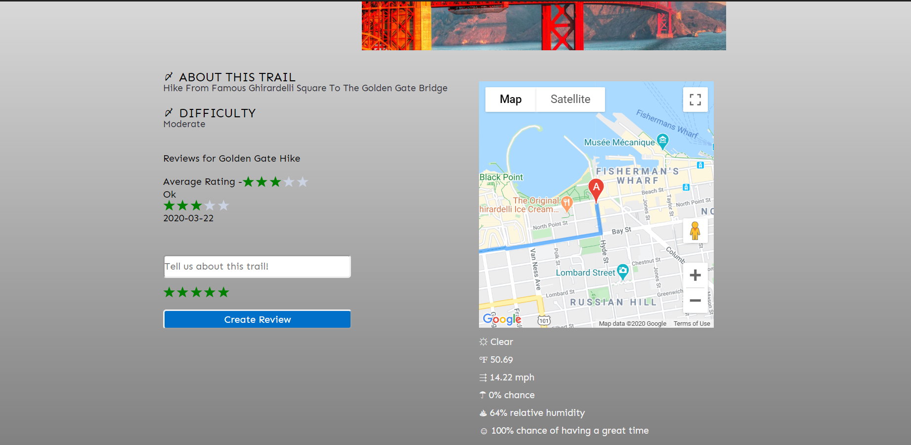

# Demo and Screenshots
[Live Demo](https://hike-sf.herokuapp.com/#/)

# Background and Overview
HikeSF is a web application that empowers outdoor enthusiasts in and around the San Francisco Bay area to share their favorite hiking trails. In the first entirely crowd-sourced application of its kind, HikeSF allows users to post, experience, and review hikes all in one place. To that effect, our team is building:

* A full stack web application using the MERN framework (MongoDB, Express, React and Node)
* Connections to the Google Maps and National Weather Service APIs to provide visualization and real-time data on hikes in the Bay
* A modern, easy-to-use UI / UX that provides a seamless experience in desktop browser and on mobile

# Functionality and MVP
- [ ] User authentication: sign up, sign in log out
- [ ] Ability to create and review hiking trails
- [ ] Interactive map display via Google Maps API
- [ ] Real-time trail stats via National Weather Service API and other APIs
- [ ] Image hosting via AWS
- [ ] Internal search engine
- [ ] Dynamic design for both desktop and mobile
- [ ] Hiking trail metasearch (bonus)

# Technologies and Technical Challenges
HikeSF's reliance on the network effect and therefore the need to rapidly grow to accommodate new users demands a lean and scalable architecture. For that purpose, our team is using a MERN stack (MongoDB, Express, React and Node).

#### Backend: MongoDB, Express, Node.js

MongoDB is a NoSQL database program that affords clients a fast, reliable, and most importantly highly scalable document-oriented database configuration. Express is an open-source framework for the Node.js runtime environment that has become the de facto backend JavaScript framework due to its robust features and high performance.

Technical Challenges:
Collecting data from OpenWeather, Google Maps, and other API and storing in database. Gathering real-time (we may only pull this information periodically at scale) weather forecast for any location selected from Google Maps. 

#### Frontend: React / Redux

The React JavaScript frontend library provides ease-of-use in building the interface of our application and will allow our team to quickly respond to changes in customer demand and sentiment. The Redux library for managing application state compliments React and amplifies our team's ability to quickly build new pages and features. 

Technical Challenges:
Rendering updated information (weather info, trail statistics, etc.) from MongoDB on request (ex: fetching data). 

# Group Members and Work Breakdown
**Victoria Campbell, Jeff Lui, Jordan Tom and Chris Terry**

#### Day 1
* Build out user authentication backend - **Jordan**
* Begin to create user creation and session forms, pending auth backend - **Victoria**
* Build out preliminary backend for hiking trails while researching Google Maps API - **Chris**
* Generate and style static pages (e.g. splash page) - **Jeff**

#### Day 2
* Research National Weather Service API and any other potential APIs that would make sense to implement - **Jordan**
* Wrap up implementation of Google Maps API - **Chris**
* Style session / user creation pages - **Jeff**
* Begin building out frontend for hiking trails pages (index, create, etc.) - **Victoria**

#### Day 3
* Implement Weather Service and other APIs - **Jordan**
* Build backend for reviews - **Chris**
* Style hiking trail pages - **Jeff**
* Create reviews frontend pages - **Victoria**

#### Day 4
* Build internal search engine - **Jordan**
* Add image hosting via AWS - **Chris**
* Wrap up frontend pages + styling - **Victoria and Jeff**

#### Day 5
* Review work and optimize for mobile - **All**

#### Days 6 - 7
* Research and implement metasearch tool that pulls from other sites - **All**